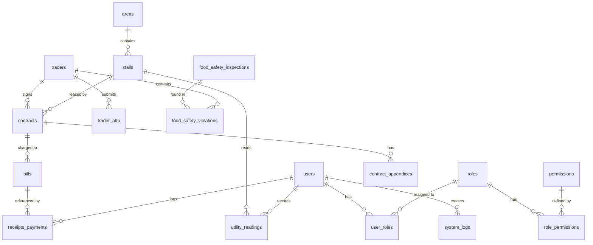

# Tài liệu Thiết kế Cơ sở dữ liệu - Hệ thống Quản lý Chợ (quanly_cho)

Tài liệu này thuyết minh chi tiết cấu trúc cơ sở dữ liệu MySQL của hệ thống **Quản lý Chợ**, được xây dựng trên mô hình phân quyền vai trò đầy đủ (RBAC), quản lý trạng thái tập trung và đáp ứng 6 phân hệ chức năng trong yêu cầu nghiệp vụ.

---

## 1. Sơ đồ thực thể quan hệ (ERD - Entity Relationship Diagram)

Sơ đồ dưới đây thể hiện các mối quan hệ giữa 18 bảng trong cơ sở dữ liệu:

---

## 2. Thuyết minh các Nhóm bảng & Chức năng

### Nhóm 1: Hệ thống & Phân quyền (RBAC & Status Dictionary)
*   **`system_statuses`**: Từ điển tập trung lưu tên hiển thị tiếng Việt và màu sắc CSS (ví dụ: `status-green`, `status-red`) của các trạng thái. Các bảng nghiệp vụ liên kết thông qua chuỗi mã trạng thái (`status_code`).
*   **`users`**: Tài khoản nhân viên của Ban Quản Lý chợ (Admin, Kế toán, Nhân viên nghiệp vụ).
*   **`roles`**: Nhóm vai trò quản trị/nghiệp vụ hệ thống.
*   **`permissions`**: Danh mục quyền hạn chi tiết gắn liền với từng chức năng hành động.
*   **`role_permissions` & `user_roles`**: Bảng liên kết trung gian (nhiều-nhiều) để gán quyền cho vai trò và gán vai trò cho nhân viên.
*   **`system_logs`**: Nhật ký hoạt động chi tiết lưu IP, User Agent, loại thao tác để phục vụ bảo mật.

### Nhóm 2: Quản lý Mặt bằng & Sạp chợ (Stalls & Areas)
*   **`areas`**: Phân chia khu vực trong chợ (Khu A chuyên thời trang, Khu B chuyên thực phẩm tươi sống, Khu C chuyên ẩm thực...).
*   **`stalls`**: Danh mục sạp kèm diện tích, đơn giá nền và **tọa độ hiển thị X, Y** phục vụ cho vẽ sơ đồ chợ tương tác trực quan.

### Nhóm 3: Tiểu thương & Hợp đồng thuê sạp (Traders & Contracts)
*   **`traders`**: Thông tin cá nhân, CCCD, số điện thoại, ngành hàng kinh doanh và trạng thái hoạt động của tiểu thương.
*   **`contracts`**: Hợp đồng thuê sạp ràng buộc giữa tiểu thương và sạp với các điều khoản ngày bắt đầu, ngày hết hạn, tiền đặt cọc và trạng thái hợp đồng.
*   **`contract_appendices`**: Lưu trữ các phụ lục hợp đồng dùng khi thay đổi giá thuê hoặc gia hạn thời gian thuê mà không cần hủy hợp đồng gốc.

### Nhóm 4: Tài chính & Tiện ích (Utility, Bills & Payments)
*   **`utility_readings`**: Ghi chép chỉ số điện nước cũ & mới định kỳ hàng tháng của từng sạp cùng nhân viên ghi nhận.
*   **`bills`**: Hóa đơn dịch vụ hàng tháng của tiểu thương, đã được **tách chi tiết** thành các cột: tiền thuê sạp, tiền điện, tiền nước, phí quản lý, phí vệ sinh, phí bảo vệ và các phí khác để thuận tiện cho việc lập báo cáo doanh thu chi tiết.
*   **`receipts_payments`**: Sổ quỹ thu chi thực tế của chợ. Lưu trữ các phiếu thu (thu tiền hóa đơn, tiền cọc) và phiếu chi (chi lương, chi sửa chữa chợ, chi điện nước chung).

### Nhóm 5: Vệ sinh An toàn Thực phẩm (Food Safety)
*   **`trader_attp`**: Lưu trữ các giấy tờ pháp lý của tiểu thương (Chứng nhận vệ sinh ATTP, Giấy khám sức khỏe, Chứng nhận tập huấn ATTP) kèm ngày hết hạn để hệ thống đưa ra cảnh báo.
*   **`food_safety_inspections`**: Kế hoạch kiểm tra vệ sinh thực phẩm định kỳ hoặc đột xuất của Ban Quản Lý và các cơ quan chức năng.
*   **`food_safety_violations`**: Biên bản ghi nhận vi phạm vệ sinh thực phẩm của các hộ kinh doanh, bao gồm mô tả hành vi, hình thức xử lý (cảnh cáo, phạt tiền, đình chỉ sạp) và tiến độ khắc phục.

---

## 3. Bản vẽ cấu trúc chi tiết (Từ điển dữ liệu)

Vui lòng tham khảo tệp SQL khởi tạo tại [schema.sql](file:///d:/xampp/htdocs/quanly_cho/database/migration/schema.sql) và tệp dữ liệu mẫu tại [seed_data.sql](file:///d:/xampp/htdocs/quanly_cho/database/seed/seed_data.sql) để xem chi tiết kiểu dữ liệu, các chỉ mục (Indexes) và ràng buộc khóa ngoại (Foreign Keys).
